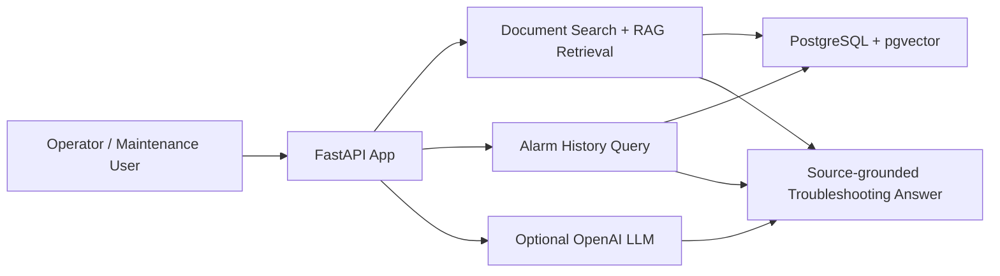

# AI Plant Operations Assistant

An AI-assisted plant troubleshooting platform for industrial operations teams. The application helps maintainers find relevant equipment procedures, review alarm history, and get source-grounded recommendations for recurring plant issues.

## Problem

Plant teams often deal with alarm bursts, incomplete operating records, and fragmented maintenance procedures spread across PDFs, tags, and handwritten instructions. This slows troubleshooting and increases the risk of unsafe or inconsistent decisions.

## Solution

This application helps operators and maintenance teams:

- search plant documentation for the right procedure quickly,
- compare the issue with recent alarm history,
- retrieve the most relevant procedure and source material,
- generate a safe troubleshooting recommendation grounded in that context.

## Why it matters

The result is faster diagnosis, less downtime, safer plant operations, and a more consistent maintenance workflow across shift teams.

## What the application is about

The assistant is built for environments where operators need quick, reliable guidance during abnormal equipment conditions. It combines:

- plant procedure documents
- equipment alarm history
- semantic search over technical content
- optional LLM-powered troubleshooting recommendations
- recurring issue detection for repeated alarms

This gives plant staff a faster way to answer questions like:

- Why is this pump showing low discharge pressure?
- What procedure should I follow for this compressor alarm?
- Has this equipment issue happened before and how often?

## Product capabilities

- Search plant documents by equipment and free-text query
- Retrieve relevant maintenance procedures with pgvector similarity search
- Generate a troubleshooting answer grounded in the retrieved procedure context
- Fall back to a safe operational recommendation if no LLM key or matching document is available
- Persist alarms in PostgreSQL and identify recurring alarm patterns
- Provide source-linked answers with next-check guidance

## Tech stack

- Python
- FastAPI
- PostgreSQL + pgvector
- SQLAlchemy
- Alembic
- OpenAI API (optional)
- Docker Compose

## Architecture overview



## Repository structure

- `backend/` – API, DB access, AI generation, retrieval logic
- `alembic/` – schema migration files
- `frontend/` – served UI shell
- `tests/` – project tests
- `docker-compose.yml` – Postgres and app containers
- `Dockerfile` – API container build
- `.env.example` – environment variable template
- `README.md` – project documentation

## Deployment

The recommended deployment flow is Docker Compose.

### 1. Create environment file

Copy the example file:

```powershell
Copy-Item .env.example .env
```

Example contents:

```env
OPENAI_API_KEY=
OPENAI_MODEL=gpt-4.1-mini
EMBEDDING_MODEL=text-embedding-3-small
CORS_ORIGINS=http://localhost:5173
DATABASE_URL=postgresql+psycopg://plantops:plantops@db:5432/plantops
AUTH_USERNAME=plantops
AUTH_PASSWORD=change-this-password
AUTH_SECRET_KEY=replace-with-a-long-random-secret
AUTH_COOKIE_SECURE=true
```

Notes:

- `OPENAI_API_KEY` is optional. The app can still operate in fallback mode without it.
- In Docker, use `db` as the database host.
- For local non-Docker Python runs, use `localhost` instead of `db`.

### 2. Start the stack

```powershell
docker compose up -d --build
```

This starts:

- PostgreSQL with pgvector
- the FastAPI application
- the Alembic migration during startup

### 3. Verify it is running

```powershell
docker compose ps
Invoke-RestMethod -Uri 'http://127.0.0.1:8000/health' | ConvertTo-Json -Depth 10
```

Expected result:

```json
{
  "status": "ok",
  "documents": 3,
  "chunks": 3,
  "alarms": 0
}
```

## Local Python run

If you want to run the app directly in the local Python environment:

```powershell
.\.venv\Scripts\Activate.ps1
python -m uvicorn backend.app:app --host 127.0.0.1 --port 8000 --reload
```

Open:

- `http://127.0.0.1:8000/`
- `http://127.0.0.1:8000/docs`

## Database and migrations

The schema is managed with Alembic.

Run migrations:

```powershell
.\.venv\Scripts\python.exe -m alembic upgrade head
```

Check migrations in Postgres:

```powershell
docker compose exec db psql -U plantops -d plantops -c "SELECT version_num FROM alembic_version;"
```

The database includes:

- `documents`
- `document_chunks`
- `equipment_alarms`
- `alembic_version`

with the `vector` extension enabled.

## API examples

### Search documents

```powershell
$body = '{"equipment":"Centrifugal pump","query":"low discharge pressure","limit":3}'
Invoke-RestMethod -Uri 'http://127.0.0.1:8000/api/search' -Method Post -ContentType 'application/json' -Body $body
```

### Troubleshoot equipment

```powershell
$body = '{"equipment":"Centrifugal pump","problem":"low discharge pressure","limit":3}'
Invoke-RestMethod -Uri 'http://127.0.0.1:8000/api/troubleshoot' -Method Post -ContentType 'application/json' -Body $body
```

### Ingest an alarm

```powershell
$body = '{"equipment":"Centrifugal pump","alarm_code":"P-204-01","message":"Discharge pressure low","occurred_at":"2026-09-21T10:00:00Z","value":1.2,"unit":"bar"}'
Invoke-RestMethod -Uri 'http://127.0.0.1:8000/api/alarms' -Method Post -ContentType 'application/json' -Body $body
```

### View recurring issues

```powershell
Invoke-RestMethod -Uri 'http://127.0.0.1:8000/api/alarms/recurring' -Method Get
```

## Security and local development notes

- Authentication uses database-backed users, scrypt password hashes, and 30-minute signed sessions in `HttpOnly` cookies.
- `AUTH_USERNAME` and `AUTH_PASSWORD` bootstrap the first admin user only; changing them does not overwrite an existing database user.
- Set a unique `AUTH_SECRET_KEY` and enable `AUTH_COOKIE_SECURE=true` when serving over HTTPS.
- Keep `.env` local and never commit secrets to source control.
- The app can run in graceful fallback mode without a valid OpenAI key or without matching source documents.

## Quick-start demo flow

For a fast live demo, use this flow:

1. Start the stack:

```powershell
docker compose up -d --build
```

2. Confirm the health endpoint is live:

```powershell
Invoke-RestMethod -Uri 'http://127.0.0.1:8000/health'
```

3. Run a sample troubleshooting query:

```powershell
$body = '{"equipment":"Centrifugal pump","problem":"low discharge pressure","limit":3}'
Invoke-RestMethod -Uri 'http://127.0.0.1:8000/api/troubleshoot' -Method Post -ContentType 'application/json' -Body $body
```

4. If you have an OpenAI key, the response will be generated from procedure context; otherwise the app falls back to a safe operational recommendation.

## Production deployment checklist

Before using this in a real plant environment, confirm the following:

- Use a secure environment-managed `OPENAI_API_KEY`
- Use a unique `AUTH_SECRET_KEY` managed by the deployment environment
- Replace the bootstrap password after the first deployment
- Serve the application over HTTPS with `AUTH_COOKIE_SECURE=true`
- Add role-specific authorization rules for administrative operations
- Run PostgreSQL in a managed or persistent environment instead of local Docker volumes for production
- Set `CORS_ORIGINS` to the actual production frontend origin
- Review document ingestion rules and access control for maintenance procedures
- Validate alert ingestion and alarm retention policies for operational use
- Monitor OpenAI quota, latency, and fallback behavior
- Back up the pgvector-enabled PostgreSQL database and migration history

## Testing

```powershell
.\.venv\Scripts\python.exe -m pytest -q
```

## Typical operational use case

An operator sees an alarm on a pump or compressor and asks the assistant for guidance. The app:

1. searches the procedure library for the equipment,
2. retrieves relevant background documents,
3. checks recent alarm history,
4. generates a troubleshooting recommendation with source citations.

This makes the plant troubleshooting workflow faster, more consistent, and better grounded in operational documentation.
